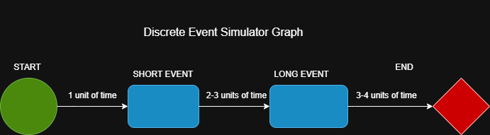

# DISCRETE EVENT SIMULATOR  



**Event-Based Simulation**

## General info  
This project implements a **discrete event simulator**, modeling a simple queueing process through a series of time-ordered events. It simulates how customers pass through two sequential service stages and records statistics about the duration of the process. This program was developed as part of a Computer Science assignment at Gdańsk University of Technology.

The simulator leverages an **event flow graph** structure, where each node represents a type of event, and edges indicate the progression of the customer through the system.


## Key Features
- **Exponential Interarrival Times**: Customers arrive based on an exponential distribution with a mean of 1 unit of time.
- **Uniform Service Times**:
  - First activity: uniformly distributed between 2 and 3 time units.
  - Second activity: uniformly distributed between 3 and 4 time units.
- **Event Queue**: A priority queue ensures that events are executed in chronological order.
- **2000 Simulation Runs**: The process is simulated 2000 times to compute statistical measures.
- **Performance Statistics**:
  - Average process duration (from arrival to end).
  - Standard deviation of the process time.

## Technologies  
The project is created with:
- **C++**
- Standard Template Library (`<queue>`, `<cmath>`, `<cstdlib>`, etc.)

## Setup  

### Option 1: Using g++ (Linux/macOS/WSL/MinGW)
```bash
g++ -std=c++11 -o simulator main.cpp Event.cpp Simulator.cpp
./simulator
```

### Option 2: Using Visual Studio
- Create a new project.
- Add the `.cpp` and `.h` files.
- Build and run the project.

No external libraries are required beyond the C++ standard library.

## How it works  
- The **GENERATOR** event creates customers within the first 10 units of simulation time.
- Each customer passes through:
  1. **FIRST_SERVICE** event (2–3 units)
  2. **SECOND_SERVICE** event (3–4 units)
  3. **FINISH** event (records total time)

All events are handled through a central **event queue** sorted by scheduled time.

## Example Output
```
Average process time: 13.57
Standard deviation: 1.68
```

## Conclusions  
This simulation accurately models a basic discrete-event queue system. Possible improvements include:
- Introducing multiple servers with different capacities.
- Adding customer priorities or types.
- Supporting parallel events or more complex graphs.

## License  
This project is licensed under the **MIT License**.

## Author & Contact  
This project is maintained by **Szymon Drywa**.

For any questions or collaboration, feel free to contact:  
📧 Email: szmekdrywa@wp.pl  
💻 GitHub: [Szmekowy](https://github.com/Szmekowy)
